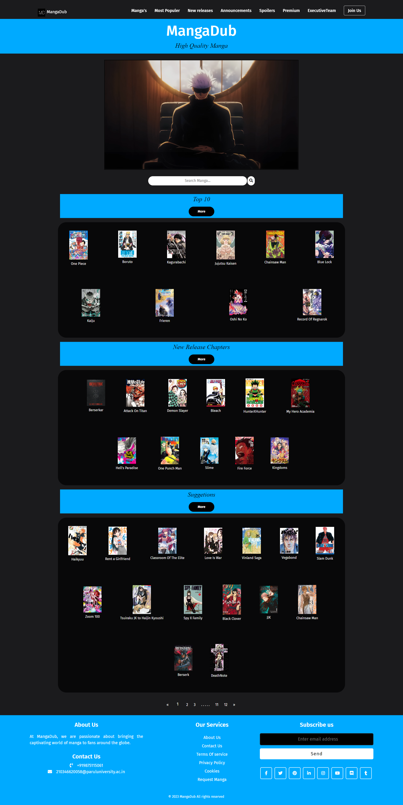

# Online Manga Reading Website

This project is a part of my diploma in Information Technology. It is an online platform designed for reading manga, incorporating HTML, CSS, JavaScript, PHP, and using XAMPP for the database management.

## Features

- User-friendly interface for browsing manga collections
- Search functionality to find specific manga titles or genres
- Reading mode with customizable settings such as zoom and page navigation
- User authentication and account management
- Bookmarking favorite manga for quick access
- Admin panel for managing manga uploads and user accounts

## Technologies Used

- **Frontend:** HTML, CSS, JavaScript
- **Backend:** PHP
- **Database:** XAMPP (MySQL)

## Installation

1. Clone the repository: `git clone https://github.com/your-username/online-manga-reading`
2. Set up XAMPP and import the database schema (`manga_database.sql`)
3. Configure database credentials in `config.php`
4. Start XAMPP Apache and MySQL servers
5. Access the website via `http://localhost/online-manga-reading`

## Usage

1. Register for an account or use the provided demo credentials.
2. Browse manga collections, search for titles, and start reading!
3. Customize reading settings and bookmark favorites for quick access.
4. Admins can access the admin panel (`http://localhost/online-manga-reading/admin`) for managing content and users.

## Contributing

Contributions are welcome! Feel free to fork the repository and submit pull requests for any improvements or bug fixes.

---

Feel free to modify and expand upon this template as needed for your specific project details!

## Screenshot

